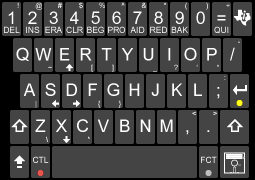
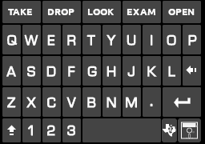
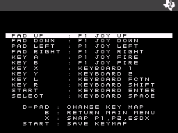
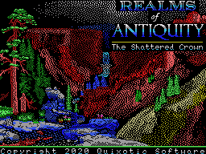

# DS99/4a
DS994a is a Texas Instruments TI99/4a Emulator for the DS/DSi/XL/LL

To run requires the TI BIOS ROMS in the /roms/bios or /roms/ti99 directory.
See BIOS files further down for the ones you need.


Features :
-----------------------
* Games and programs run at or near full speed across the spectrum of DS hardware (though the emulator targets the DSi / XL for optmium performance)
* Cart loads up to 8192K (8MB) on the DSi and 512K on the DS using standard TI99 bankswitching (+40K of GROM beyond the 24K Console GROM)
* Mixed mode C/D/G/8/9 files supported as well as the MESS/MAME .RPK (Rom PacKs) format
* 32K RAM Expansion built-into the base console emulation
* SAMS at full 1MB for the DSi (and above) and 512K for the older DS/DS-Lite units
* MBX, Mini-Mem and Super Carts supported with extra RAM. Use Options to select cart type
* Save and Load State (one slot per game)
* High score saving for up to 10 scores per game
* Full mapping of any of the 12 DS keys to any combination of TI Joysticks/Keyboard
* Virtual TI-99/4A keyboard with classic stylings just the way you remember it
* Disk Support for DSK1, DSK2 and DSK3 up to 360K each using the standard TI Disk Controller (you need 994adisk.bin - see BIOS files below)
* The TI Speech Synth is not fully emulated - but there are built-in speech samples for the following games: Parsec, Alpiner, Moonmine, Buck Rogers, Star Trek, MASH, Bigfoot, Superfly, Microsurgeon, Fathom, Sewermania, and Borzork.

Copyright :
-----------------------
DS99/4a is Copyright © 2023-2024 Dave Bernazzani (wavemotion-dave)

This program is made up from a number of constituent bits and pieces of code from
other emulators plus a lot of original code to glue it all together and run it on the DS. 
As such, the following copyrights apply:

The SN76496 sound core is from FluBBa and is used with permission. 

The lowzip library and yxml parser are used following the generous MIT licences they 
were released under.

The TI9918A code came from Marat Fayzullin (ColEM) and retains Marat's original copyright
statement. Do not use any of that code without trying to contact Marat.

The TI9900 CPU core is mainly my own with some significant bits of scaffolding from 
Mike Brent's Classic99 emulator - especially in the status bits handling and some 
of the more tricky opcode algorithms so they run correctly. This is used with permission 
and with great thanks!

For the rest of the code: as long as there is no commercial use (i.e. no profit is made),
copying and distribution of this emulator, its source code and associated readme files, with 
or without modification, are permitted in any medium without royalty provided this copyright
notice is used and wavemotion-dave is thanked profusely.

The DS99 emulator is offered as-is, without any warranty.

Credits :
-----------------------
* Thanks to Alekmaul who provided the original Coleco emulator framework of which this is based.
* Thanks to Flubba for the SN76496 sound core (virtually the same as the TI9919 sound chip).
* Thanks to Marat Fayzullin (ColEM) for the TI9918A video driver.
* Thanks to Mike Brent for Classic99 and letting me use some of the disk and CPU core code plus some helpful consults.
* Thanks to Pete Eberlein for his help debugging and some great ideas and a bit of code from his upcoming BuLWiP emulator.
* Thanks to ti99iuc over on AtariAge for the original DS99/4a logo and to StephenJ for the updated 2.0 logo.
* Thanks to Darryl Hirschler for the TI99 Keyboard Graphics.
* Thanks to the 99ers over on the AtariAge site for their help in grokking memory layouts and banking schemes as well as testing and providing feedback.

Installation :
-----------------------
* To run this on your DS or DSi (or 2DS/3DS) requires that you have the ability to launch homebrews. For the older DS units, this is usually accomplished via a FlashCart such as the R4 or one of the many clones. These tend to run about US$25. If you have a DSi or above, you can soft-mod your unit and run something like Twilight Menu++ or Unlaunch which will run homebrew software on the DS. The DSi has a convienent SD card slot on the side that saw very little use back in the day but is a great way to enjoy homebrews. See https://dsi.cfw.guide/ to get started on how to soft-mod your unit.
* You will need the two console BIOS files as described below. Place both .bin BIOS files into /roms/bios (you can just make the directory on your SD card).
* You will also need the emulator itself. You can get this from the GitHub page - the only file you need here is DS994a.nds (the .nds is a executable file). You can put this anywhere - most people put the .nds file into the root of the SD card.
* If you want to play disk based games (Adventure, Tunnels of Doom, etc) you will need 994adisk.bin (often just named disk.bin but you need to rename it and put it into /roms/bios).
* You will need games to play... right now the emulator supports C/D/G files plus '8' non-inverted files and '9' inverted files. Basically just try loading a file to see if it works... the ROMs should have a .bin extension. 
* Recommend you put your game ROMs into /roms/ti99 as the emulator will default to that directory. That's where the cool kids keep them.
* Recommend you put any disk files needed in a directory easily accessible (near) where you store your rom files so it's a faster navigation.

BIOS Files :
-----------------------
Here are the BIOS file CRC32 hashes I'm using with all of my testing - seek these out if you want maximum compatibility.
```
* db8f33e5	994aROM.bin (8K)
* 584b3dca	994aGROM.bin (24K) [a CRC of af5c2449 is also acceptable]
* de1f2e25	994aDISK.bin (8K)  [a CRC of 8f7df93f is also acceptable] - for .DSK support
```

BIOS files should be placed in either /roms/bios (recommended - that's where the cool kids keep them) or /roms/ti99 or they can be put in the same directory as your game ROMs. Do not ask me for BIOS files - you will be ignored.

Known Issues :
-----------------------
* TI Speech Module is not fully supported. Games that rely on the module will still play fine - and many of the classic games have speech samples built into the emulator and will play and sound just as you remember them (e.g. Alpiner, Parsec, Moonmine, etc)
* MBX-only games (Championship Baseball, I'm Hiding and Terry's Turtle Adventures) will not run as the full MBX system is not emulated (other MBX-optional titles with 1K of RAM work fine: e.g. Bigfoot, Superfly, etc).
* Dragon's Lair 8MB demo will load and run but the sound sampling is not fast enough on the handheld to render the direct sound output.

File Types Supported :
-----------------------
DS994a supports the following file types:
* Files whose base filename ends in C/D/G files also known as 'mixed mode'. If there is a 'D' file, it must be exactly 8K. C is the main binary and G is the GROM binary. If a C/D/G file is detected, only the C (or G if it's GROM-only) will be shown in the file listing.
* Files whose base filename ends in '9' or '3' are considered "inverted" files and the banks will be swapped appopriately.
* Files whose base filename ends in '0' is considered a system GROM and can be used to replace the standard console GROMs (e.g. Son of Board).
* All other files are considered '8' files which is non-inverted banking up to 8192K (8MB) for the DSi and up to 512K for the older DS hardware.
* There is a limit of 512 ROM files per directory and 256 DSK images per directory. You can have as many directories as you wish.
* Filenames are limited to 128 characters. Shorten your ROM filenames if you run into this.
* As of version 2.0, the MAME/MESS .rpk (ROM PacK) format is also supported - these are single file archives that contain the ROMs and a layout.xml file that describes where the ROMs get loaded and how any banking might work.

If you wish to associate a .dsk file with your cart (e.g. Adventure or Tunnels of Doom, etc.) you can name the .dsk files with the same base name as the cart and replace the C/D/G/8 with 1, 2 or 3.

For example, for Tunnels of Doom you might have:

- TunnelsOfDoom_g.bin   - The Tunnels of Doom GROM cart
- TunnelsOfDoom_1.dsk   - The Tunnels of Doom disk mounted as DSK1

When you load Tunnels of Doom, it will automatically mount TunnelsOfDoom_1.dsk

For something like Realms of Antiquity you can have:

- roa_8.bin   - The 256K cart
- roa_1.dsk   - The first disk to mount as DSK1
- roa_2.dsk   - The second disk to mount as DSK2
- roa_3.dsk   - The third disk to mount as DSK3

(the underscores are just a personal preference of mine as I find it makes the filenames look cleaner and more clear. It's not required by the DS99/4a emulator)

RPK files can also have associated .dsk files - just use the same base filename and add 1.dsk or 2.dsk
For example:

- Adventure.rpk
- Adventure1.dsk

Configuration :
-----------------------
There are two levels of configuration:
* Global Configuration sets defaults for all games - though most things can be overridden at the individual game level.
* Game Configuration is specific to the game you've loaded.

Be sure to use the START button to save out your configuration options so they persist on future launches of the emulator.


Emulated Disk Drives :
-----------------------
DS994a will support 3 Disk Drives all at up to 360KB as DSK1, DSK2 and DSK3. On the DSi, all three disks are fully buffered read/write. 
On the older DS-Lite/Phat, only the first two drives are fully buffered and read/write. DSK3 is read-only. 
I'm using the TI99 standard Disk Controller but with a modification to allow up to 360KB disks to be supported. 
Any writes to disk should be auto-persisted and written back to the SD card. 
Please be aware that I've seen the rare glitch when writing to some SD cards - emulation coupled with homebrew libraries for writing the SD on the DS is not perfect. 
With that in mind, I've added some safeguards... before the write takes place, I rename the original .DSK to .DSK.BAK so it's hanging around.
If the write fails and freezes up, the next time you boot the emulator and load that disk, it will check if the .DSK.BAK file is around and will revert to that
as needed (it does mean that you will have lost your last save...). Also, in the DISK MENU you can 'BACKUP DISK' which you should do occasionally...
this will make a /BAK directory and copy the desired .DSK file into that directory for safe-keeping. Using these precautionary methods, you should be able 
to work around any potential glitches when writing the disk files back to the SD card. Most users will not run into such issues.

Keyboards and Menus :
-----------------------
Two virtual keyboards are supported... both emulate the look and feel of a real TI keyboard. One has a slightly 3D/raised-key look and the other is a more flat look. Experiment and find the one that best suits you - you can set a global default choice in the Global Configuration menu. Pressing the TI logo in the upper right will bring up a mini-menu to let you save the game state, exit the game, load up a .DSK image, etc. 

  

Key Mapping :
-----------------------
You can map all 12 of the DS keys (ABXY, D-Pad, Start, Select, Left/Right Shoulder Buttons) to any TI key (Joystick 1, Joystick 2 or Keyboard Key). 
By default the shoulder buttons are used for FCTN and SHIFT which is convienent as there are many games that require the Function keys. You can also press the X key to toggle P1, P2 and Keyboard Game mapping while in the "Configure Keys" area.



There are also some special keys that are always available:
* Hold Left Shoulder + Right Shoulder + X and you will swap the top/bottom screens.
* Hold Left Shoulder + Right Shoulder + Y and you will take a .BMP snapshot of the top screen (written to SD card with date/time as the filename).

Memory/System Configurations :
-----------------------
By default each game is configured to run on a 32K expanded system which runs 99% of all TI99/4a games. The SAMS support must be enabled on a per-game basis (you can also set to have the SAMS support enabled globally). Be aware - the SAMS handling does require a more accurate emulation core and will slow down the emulation by almost 15%.  That's fine for the DSi (or better) with the 2X CPU speed but my recommendation is to use the default 32K expanded system for virtually all games and only enable the SAMS support for the few things that need it.

To complicate things further, there is also a setting for Mini-Memory (4K of RAM mapped at 7000h) and SuperCart (8K or 32K of RAM mapped at 6000h to 7FFFh).  There are a few games that need this extra 8K of memory to operate (mostly a few of the complex Infocom games).  Those games are often identified with a _SC at the end of the filename. To use those games, you would load with the Editor-Assembler (EA) module and change the Cart Type to 'Super Cart'. Since the EA cart loads into GROM space, it can allocate that extra 8K of RAM for use by the program. You would then load your program requriing SuperCart memory via EA option '5' and specifying DSK1.FILENAME

How do I play Adventure or Tunnels of Doom? :
-----------------------
Some of the most well-remembered games on the TI99/4a were the Scott Adam's Adventure Games and my personal favorite: Tunnels of Doom (an early dungeon crawler that probably has more to do with my wanting a TI99/4a emulator on my DS than anything). To play these games requires that the 'database' for each game is loaded from somewhere. Back in the day, we loaded via Cassette. But for DS99/4a we don't have analog cassette support so you'll have to load from Disk. To do so:
* You will need the 994aDISK.bin as mentioned in the BIOS files section above.
* You will need the cartridge files for the game (AdventureG.bin or TunnelsG.bin or similar)
* You will need the disk (.DSK) image for the game you want to play
* Load the cartridge file normally... then use the TI Menu to mount the .DSK
* For Adventure you load the game by typing "DSK1.PIRATE" (for Pirate's adventure... or whatever name/game you want... use LIST DISK to see what's on the disk as there were more than a dozen Scott Adams adventure games).
* For some adventure games you should enable the ALPHA LOCK key in Game Options or use the ALPHA LOCK key on the TI99 Keyboard.
* For Tunnels you load the game by selecting 2) DISK and then type in the name of the quest you want to play (usually named just "QUEST" without the DSK1 part). Or you can use the DISK menu to list what's on a disk and paste it in automatically.


How do I play Realms of Antiquity? :
-----------------------
In 2020 a new C-RPG was released for the TI99/4a called Realms of Antiquity. A labor of love for more than a decade of hand-crafting this is the pinnacle of RPGs for the TI99/4a. It is playable on DS994a but requires all three disk drives to be used.
* Ensure SAMS 512K/1MB is enabled in configuration for this game.
* Load the binary roacart.bin as your cartridge and advance to the TI title screen
* Using the TI Menu in the upper right... mount DSK1 with ROAGAME.DSK, DSK2 with ROAWORLD12.DSK and DSK3 with ROAWORLD34.DSK
* Enjoy - save often and make use of the BACKUP DISK to occasionally save off the ROAGAME.DSK (DSK1) into a /bak directory for maximum caution in case something ever goes wrong with writing the master copy.



How do I play Frogger? :
-----------------------
No way to start the game? That's because it utilizes Joystick 2 unlike most every other game. Before the game starts, go into Controller Settings and press the X button to toggle form P1 controls to P2 controls. Save those controls out - the game should work fine. Star Trek similarly uses P2 controls and you'll want to map a few other keys for Photon Torpedos and Warp to various DS keys for maximum play-ability. If you're using a standard ROM for Frogger, the emulator should auto-set this by default.

How do I play Q-Bert? :
-----------------------
A few games want you to press diagonals for movement such as Q-Bert. This is a little awkward on the d-pad. I find that re-mapping the keys such that D-PAD UP is Joystick Right, DOWN is Joystick Left, LEFT is Joystick Up and RIGHT is Joystick Down works quite well. This replicates the non-diagnoal use of the controller and mimics the way some other home ports (notably the Colecovision) work. If you're using a standard ROM for Q-Bert, the emulator should auto-set this by default.

How do I play Bigfoot and other MBX games? :
-----------------------
Some of the Milton Bradley games use a cart banking scheme known as MBX (they also had a set of peripherals called the MBX System). 
DS994a needs to be told that a cart is an MBX cart.  Some of the MBX carts had extra memory. 
So after you select an MBX game like Bigfoot, you must go into GAME OPTIONS and tell it that it's an MBX cart (in this case 'With RAM'). 
Then the game should play fine. If you are using a well-curated ROM set, the emulator should auto-detect these settings and run properly without user intervention here.

Blend Mode (DSi) :
-----------------------
DS99/4a supports a "blend mode" which I borrowed from my scheme on StellaDS. In this mode, 
two frames are blended together - this is really useful when playing games like TI Invaders or Scramble
where the bullets on screen are small and the DSi LCD just doesn't hold onto the pixels 
long enough to be visible. These games were designed to run on an old tube TV with phosphor which 
decays slowly so your eye will see slight traces as the image fades. This emulates that (crudely).
On the DSi using this new mode renders those games really bright and visible.

The DSi XL/LL has a slower refresh on the LCD and it more closely approximates the old tube TVs... 
so blend mode is not needed for the XL/LL models.

However! Using blend mode comes at at 15% CPU cost!! The DSi can handle it... the DS-LITE/PHAT might
struggle a bit on more complicated games. 

So my recommendation is as follows:
* DSi non XL/LL - use Blend Mode for the games that benefit from it (e.g. TI Invaders).
* DSi XL/LL - don't bother... the XL/LL screen decay is slower and games look great as-is.
* DS-LITE/PHAT - you can try it but the framerate might drop below 60 on some games.

To enable this new blend mode, pick your game and go into the "Game Options" sub-menu and turn it on.

Compile Instructions :
-----------------------
devkitpro-pacman version 6.0.1-2
gcc (Ubuntu 11.3.0-1ubuntu1~22.04) 11.3.0
libnds 1.8.0
I use Ubuntu and the Pacman repositories (devkitpro-pacman version 6.0.1-2).  I'm told it should also build under 
Windows but I've never done it and don't know how.

If you've got the nds libraries above setup correctly it should be a matter of typing:
* _make clean_
* _make_

To build the emulator. The output of this is DS994a.nds with a version as set in the MAKEFILE.
I use the following standard environment variables that are SET on Ubuntu:
* DEVKITARM=/opt/devkitpro/devkitARM
* DEVKITPPC=/opt/devkitpro/devkitPPC
* DEVKITPRO=/opt/devkitpro

To create the soundbank.bin and soundbank.h file in the data directory:

mmutil -osoundbank.bin -hsoundbank.h -d *.wav

And then move the soundbank.h file to the arm9/sources directory


Versions :
-----------------------
V2.3: 19-Dec-2024 by wavemotion-dave
* Refactored memory allocation to buy back almost 400K of much needed DS RAM (mostly for new speech samples)
* Added speech samples for: MASH, Sewermania, Buck Rogers and Borzork and added missing samples for Fathom and Microsurgeon.
* Re-sampled Superfly for improved speech.
* Minor tweaks and improvements under the hood to get ready for 2025!
* V2.3a - hot fix for Realms of Antiquity which was no longer loading properly on a DSi system. Sorry about that!

V2.2: 15-Dec-2024 by wavemotion-dave
* Fixed paste of filenames allowing more characters (not just A-Z, 0-9)
* Added sound (speech) samples for Microsurgeon.
* Added sound (speech) samples for Fathom.
* Fixed River Rescue (improved VDP interrupt mask handling).
* More games load with better key maps (e.g. Defender now auto-maps X and Y as Hyperspace and Smart Bomb).
* Reverted to allowing both '3' and '9' as the file type modifiers for "inverted cart type". There are examples of both in the wild.
* Main menu cleanup and refactor.

V2.1: 09-Mar-2024 by wavemotion-dave
* Now using a small light on the CAPS/ALPHALOCK key to indicate if CAPS LOCK is on (cleaner look).
* GROM auto-increment of address will properly preserve the upper bits so we don't inadvertantly select the next GROM in our system (accuracy).
* Added partial speech samples for MB Superfly.
* Minor cleanups of SAMS handling and improved commenting in that driver.
* Improved TMS9900 debugger for development use.

V2.0: 01-Mar-2024 by wavemotion-dave
* Support for .rpk (Rom PacKs - same as used by MAME/MESS).
* Fix for save/load state of games that use RAM (MBX carts, MiniMem, etc)
* Improved SAMS handling so that the proper amount of RAM is detected
* On DSi and above, DSK3 is now fully buffered and writable.
* Lots of small tweaks and cleanups across the board as time permitted.
* Refactored and reduced resources so we free up an additional 256K of valuable memory for the future!

V1.9: 24-Feb-2024 by wavemotion-dave
* Improvements to the TMS9900 CPU core to improve accuracy and slight optmization for another frame of performance.
* Added new global configuration default for frame skip (DSi, by default will disable frame skip and the DS-Lite/Phat will enable light frameskip).
* Improved Disk menu handling to show free space and used space plus some instructions on how the paste buffer works.
* Lots of cleanup and code comments added across the board.

V1.8: 19-Feb-2024 by wavemotion-dave
* Improvements to the TMS9918a emulation to fix 5th sprite handling and improve collision detection. Megademo, Eric in Monsterland and Interceptor all work correctly now.
* Fix for Robots of Death II so it starts properly (was hanging on Speech detection).
* DSi now supports up to 8192K (8MB) banked ROMs (the older DS still supports 512K). The Dragon's Lair demo will run but won't process speech/sound as the emulation can't sample the SN sound chip fast enough for that game. 
* Optimized VDP rendering and CPU memory read/writes to be a bit faster to help with older DS hardware. This gives a 5-50% speedup in video rendering depending on the game. The megademo will sustain 60fps throughout on a DSi.
* Properly offset the text modes by 8 pixels so that games like Adventure will center text properly.
* Improved memory density so that we end up with more cache-hits than misses when dealing with CPU memory - this gives a nice speedup of several percent across the board.
* Lots of code comments and refactoring improvements as time permitted.

V1.7: 16-Feb-2024 by wavemotion-dave 
* Integrated the updated SN sound core for more robust sound.
* Fixed audio squeals and other odd noises in a few games (e.g. Borzork, Mission Destruct, etc).
* Fixed RAM mirrors so more games play correctly - DSi defaults to RAM Mirrors ENABLED.
* Fixed SAMS 16-bit memory read access so programs like SAMSTEST4 detect the memory.
* New classic floppy disk read/write sounds (can be disabled in Global Settings).
* Added new diagonal DPAD configuration to aid a few of the Q-Bert like games.
* Added new options for 90% (slower than normal) and up to 150% (faster than normal) emulation.
* Added the ability to auto-mount disks based on the filename. See File Types Supported in the readme for details.
* Lots of minor cleanups and tweaks at time permitted.
* Due to the extensive updates, the save states and configuration files have changed and will be wiped when loading this new version.

V1.6: 17-Aug-2023 by wavemotion-dave 
* New icon for Twilight Menu - woot!
* Fixed missing arrows on TI-99 Classic Keyboard graphic.
* Other minor cleanups and tweaks at time permitted.

V1.5: 29-Mar-2023 by wavemotion-dave
* Fixed minor cosmetic glitches with menu handling and ROM file selection.
* DSi now supports up to 2048K (2MB) banked ROMs (the older DS still supports 512K).
* Other minor cleanups as time permitted.

V1.4: 01-Mar-2023 by wavemotion-dave
* Added new 3D TI virtual keyboard. Removed old grey grid-style keyboard.
* New dark menu theme throughout to more closely mimic the black/silver stylings of an old-school TI99/4a.
* Improved memory usage and refactored code to allow for better future expansion.
* Fixed VDP writes so Funware's Ambulance now plays correctly.

V1.3: 24-Feb-2023 by wavemotion-dave
* More speech samples added. Parsec, Alpiner and Moonmine have all speech phrases included. Star Trek and Bigfoot have partial speech included.
* Improved memory usage to gain back a bit more resources for future expansion.
* Minor cleanups as time permitted.

V1.2: 20-Feb-2023 by wavemotion-dave
* Speech samples added for Parsec, Alpiner and Moonmine. It's not perfect but does bring back the feels of those games with speech!
* Added additional TI keys that can be mapped to the DS.
* Minor cleanups as time permitted.

V1.1: 14-Feb-2023 by wavemotion-dave
* New compile with GCC 9.4.0 and latest DEVKITPRO and libnds 1.8.0
* Improved DSK writes for greater consistency and safety
* Reverted to -O2 compilation optimizations for greater stability
* Improved TI keyboard graphic - more legible and cleaner look
* Minor cleanups as time permitted.

V1.0: 11-Feb-2023 by wavemotion-dave
* Improved TI99 keyboard which is the new default.
* Improved DSK saves for more robust writes.
* Screen Snapshot added (press and hold L+R+Y)
* Ability to swap upper / lower screens (press and hold L+R+X)
* Cleanup across the board for the official 1.0 release.

V0.9: 02-Feb-2023 by wavemotion-dave
* Added DSK3 support. All three drives support up to 360K disks. 
* Improved emulation on SAMS memory such that Realms of Antiquity will run.
* Persist SAMS memory on Save State/Load using RLE compression.
* Other cleanups as time permitted.

V0.8: 29-Jan-2023 by wavemotion-dave
* Added DSK2 support and both drives now handle up to 360K disks. 
* Improved default key mapping so X='1' and Y='2' allowing faster game startup.
* Inverted .bin files now supported with the filenames ending in '9'.
* Added ability to paste in DSKx.FILENAME from the Disk menu
* Other cleanups as time permitted.

V0.7: 24-Jan-2023 by wavemotion-dave
* New TI99 Keyboard Layout - select in Global Options or on a Per-Game basis.
* Better DSK vs ROM handling - remembers last directory for each.
* SAMS 1MB enabled for DSi and above.
* Fixed save/load state for Mini-Men, SuperCart and MBX Carts (only SAMS save/load is non-functional right now).
* Other cleanups as time permitted.

V0.6: 21-Jan-2023 by wavemotion-dave
* Re-write of the CPU core. It's 20% smaller and 20% faster.
* Added ability to list disk contents so you can see what programs are on it.
* Added write-backing of .DSK files. When they change the file is written out in the background.
* Added SAMS 512K expanded memory support - must be enabled in OPTIONS on a per-game basis.
* Added new cartridge types to support SuperCart 8K, MiniMemory 4K and Milton Bradley MBX carts (with and without special 1K RAM).
* New splash screen... new logo icon... a fresh start!

V0.5: 12-Jan-2023 by wavemotion-dave
* Streamlined save and load of save state so it's only 2 blocks of SD card (64K).  Old saves will not work with version 0.5 - so finish your games before you upgrade.
* Fixed banking so that Skyway8.bin (and probably others) will load properly.
* Improved CPU and memory reset so games are less glitchy when starting up after having just played another game.
* Another frame of performance squeezed out of the CPU core.

V0.4: 9-Jan-2023 by wavemotion-dave
* Added .DSK support for 90K and 180K disks (read and write both work but write doesn't yet persist back to SD card). Use the Cassette icon in the lower left of the keyboard to mount disks.
* Added High Score support for 10 scores per game. Use the new 'HI' button on the main keyboard.
* Fixed loading of 8K "banked" games (Tuthankam, Mancala, etc).
* Fixed right-side border rendering for "TEXT MODE" games (Adventure, Zork, etc).
* Added new option to mirror console RAM. This is more accurate but slows down the emualation. Congo Bongo needs this to render level 2+ properly.
* Games that were hanging looking for Speech Synthesis module no longer freeze up (no voice yet but you can play them).
* Keyboard is now more robust - presses are always properly 'clicked' and it's less glitchy. Key repeat now works.
* Other minor cleanups as time permitted.

V0.3: 7-Jan-2023 by wavemotion-dave
* Improved speed 8% across the board
* Fixed spirte cut-off at top of screen
* Fixed X in control mapping so that it toggles P1 vs P2
* Added PAL (along with default NTSC) support
* New splash screen and logo
* Other minor cleanups as time permitted

V0.2: 6-Jan-2023 by wavemotion-dave
* Increased bankswitch support to 512k
* Fixed IDLE instruction so games like Slymoids works
* Improved speed by 10-15% across the board... 
* Other minor cleanups as time permitted

V0.1: 5-Jan-2023 by wavemotion-dave
* It works! Almost...
